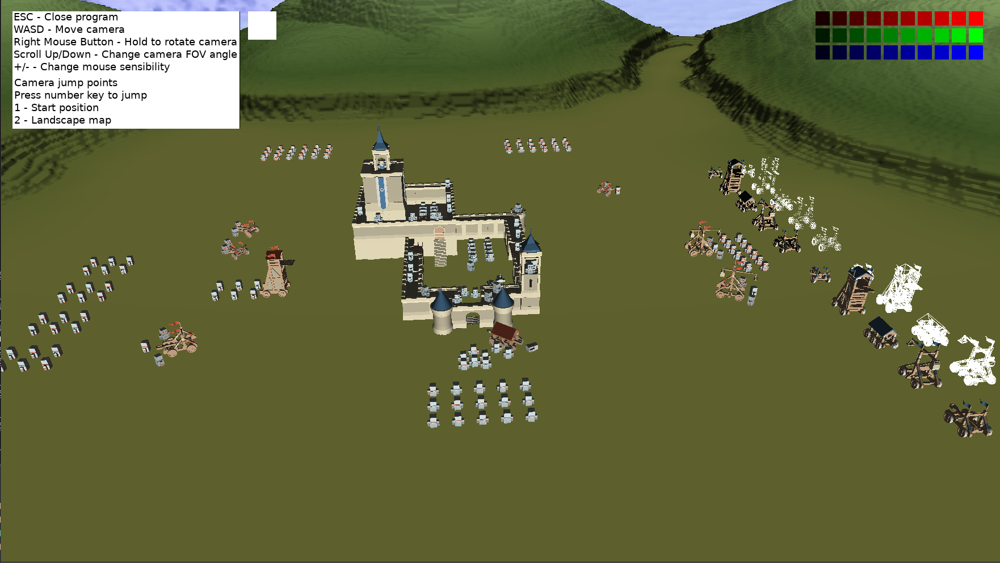
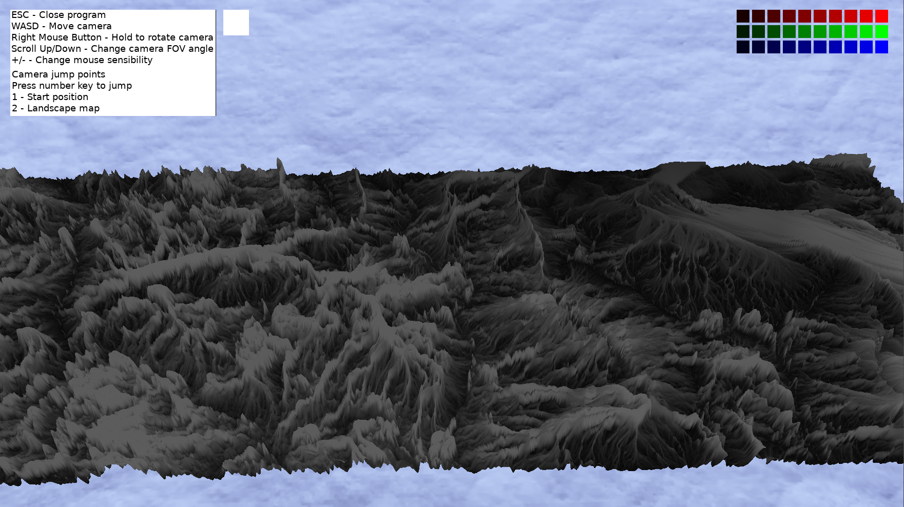
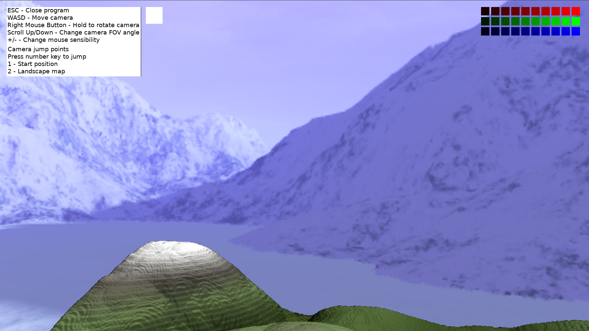

## Vulkan

I started this project to learn the basic of Vulkan. After finishing the recommended tutorial at [https://vulkan-tutorial.com](https://vulkan-tutorial.com), I wanted more and decided to expand the scope of the project to create a Vulkan renderer.

My first step was to change the simple and "linear" program (one class with everything mashed together) from the tutorial into a clearer and more functional program.

The initial monolith class has been broken into smaller classes that control different Vulkan components:
- VulkanContext - init Vulkan api and devices;

- CommandBuffer - init and manage main command buffer;

- Swapchain - init and manage the swapchain;

- RenderPass - init main renderpass;

- Framebuffer - init main framebuffer;

- Pipelines - init main graphics pipeline and its derivatives;

- VulkanResources - inti and manage some Vulkan objects that need to be created only once but are used by many other objects (like descriptors layouts).

In addition to this main separation, more functionalities were added with the memory manager being the most important. With Vulkan we need to manage the memory used by the program,
and as it is not recommended to allocate and bind many small memory chunks, I created a memory manager to allocate big chunks and bind small pieces of it when needed.

The manager is divided in two pieces, the manager itself and memory blocks. The manager creates and manages the lifespan of the blocks and the blocks manage the individual memory requests.

###### How does it work:
- Program requests a new buffer (for example, a staging buffer used in texture creation);

- Memory manager asks each memory block, of the requested memory type, if it has space to answer the request:
 - If yes, the block binds the memory area and provides the offset;

 - If no, the manager asks the next block;

- If no block has space, the manager creates a new block with the next power of 2 size in relation to the needed space (if needed 46MB, create new with 64MB), and the block binds the memory

At this point, there is not defragmentation functionality and image and "regular" memories use separated blocks, to avoid granularity problems. It will change in the future.

Together with these structural changes, more classes have been created, some moe complete than others:
- ResourceManager - Loads and stores resources loaded from files, in order to avoid memory waste and reduce file loads:

 - ex: if 3 models use the same texture, we load it once and provide a pointer to each model.


- Camera - init and controls a camera (position, projection, fov angle, rotation, and more);

- Mesh - stores the data of a mesh and its associated buffers.

- Model - simple class holding the meshes of a single model, as well as a Uniform Buffer Object shared by all os its meshes (this class will be removed as this methods is not the best)

- Material - stores mesh data related to colours, and textures needed by the shaders (this class will be reworked to allow the use of more maps by the shaders).

Speaking of shaders, this version of the project expanded on them quite a bit.
Vulkan uses a precompiled intermediate language for shaders, Standard Portable Intermediate Representation ([SPIR-V](https://www.khronos.org/spir/)), so you can use the shader language you want, provided that you compile it into a valid SPIR-V program, in my case I use GLSL.

The main shader I use is a diffuse shader. It renders a models with a diffuse map and applies a diffuse colour. It also applies ambient and diffuse lighting.
Regarding the lighting, I think there is a problem with the vertex normals, as some diffuse lighting does not seem right. To better check if that is the real problem, I will implement geometry shaders so I can render the normals and check if they are correct.
You can check the diffuse shader by reading the files "diffuse.vert" and "diffuse.frag", inside the "src/shaders" folder for the vertex and fragment shaders respectively.

All used shaders are:
- diffuse - explained previously;

- skybox - the fragment shader expects a cubemap sampler instead of a regular one;

- toon - similar to the diffuse, but for a change in fragment lighting (I do not like the result, something is not right);

- ui - uses homogenous coordinates for vertices (this shader will be completely redone as this method in not the correct one, but works for now);

- wireframe - does not apply any lighting and uses a hardcoded colour. It is used in conjunction with pipeline rasterizer poligon mode to render models in wireframe mode or points mode (examples present in the program).

All shaders will de modified in the future, when I implement push constants, instanced rendering and dynamic uniforms as they alter the shader input structure.

###### Other functionalities

- Skybox - load a skybox and uses a cubemap to render its faces;

- Heightmap terrains - load heightmap images and creates terrain meshes. Can apply a diffuse map and a normal map. Also the heightmap can be smoothed out by averaging a vertex height with its neightbours;

- UI - very basic ui rendering that can show some images in overlay mode (uses homogenous coordinates instead of world ones, also uses its own shader);

- Commandbuffer reset - the ability to rebuild a scene to add or remove objects to the renderpass.

Lastly, the entire scene, with the exception of the skybox, terrains and UI, are created based on data loaded from lua scripts. I chose lua as it is a widely used scripting language and I have already used it in another project. I facilitates some testing without having to rebuild the program. Also comparing to the data language I used before, JSON, it allows comments (this is big for me).


On another note, the models and maps are from the following places:
- Castle, soldiers and siege engines - Kenney castle kit ([link](http://kenney.nl/assets/castle-kit)), you can buy them to support the creator;

- Skybox textures - created by [amethyst7](http://amethyst7.gotdoofed.com) available at [http://www.custommapmakers.org/skyboxes.php](http://www.custommapmakers.org/skyboxes.php)

- Small terrain - created online in a texture generator ([link](https://cpetry.github.io/TextureGenerator-Online/))

- Small terrain normals - created online with Scharr filter at [link](https://cpetry.github.io/NormalMap-Online/)

- Big terrain - heightmap from the UE4 free landscape demo

### Next
My next step will be to port the Entity-Component-System (ECS) system from my [GenericSDL](https://github.com/N4G170/generic) project. It will allow for an easier world manipulations of models and for a cleaner model-mesh relationship (well, the model will disappear and the mesh will be converted into a specialised component, but I'll be able to manipulate, in world, each mesh).
After that, I will port my [sdl_gui](https://github.com/N4G170/sdl_gui) project, making it work with vulkan and on top of the ECS.

Together with the ECS and gui ports, other elements will also be worked on or newly implemented, being the most important:
- Anti-aliasing and Shadows - no need to explain
- Push constants - will allow smaller UniformBufferObject;
- Instanced rendering - will allow vertex buffers to be reused by other meshes;
- Dynamic uniforms - will allow fewer uniform buffers;

The next three are less important(right now) but nonetheless interesting:
- Multiple subpasses - will allow me to better understand render passes
- Multi-threaded command buffer generation - I am very curious as it will force me to use fences and semaphores.
- Compute shaders - I am very curious

Note: If you have any suggestion let me know.

### Screenshots

Small terrain (smooth applied on mesh) and castle area


Big terrain (smooth applied on mesh)


Piece of small terrain and piece of the skybox


### Running the program

To run the program you need a PC with windows 7+ 64bit or linux 64bit and a gpu that supports vulkan and at least 512MB of graphic memory (I am wasting a lot of memory until I improve model related buffer creation and usage).

You can download the latest release from the release tab ([link](https://github.com/N4G170/vulkan/releases)) or you can build it yourself.
The windows release has the needed dlls but on Linux you need to install the dependencies SDL2, SDL2_image, lua, assimp and vulkan (it should already be installed with you gpu drivers). C++ runtime libs should already be installed on both systems, if now install them.

### Building

#### Linux

To build on Linux just use the provided cmake project, but first you must install the dependencies:
- SDL2
- SDL2_image
- vulkan sdk //you need to check what your distro package is
- lua
- glm
- assimp //for model loading
- cmake //so you can use the CMakeLists.txt files
- c++ compiler //I use gcc

After that, download the project and open a terminal at the root of the project (the folder with this file) and run the commands:

```
- mkdir build
- cd build
- cmake ..
- make -j
```

If no errors appear, the build is complete inside the "bin" folder and you can run the program with the command ./vulkan in your terminal or double click on it.

#### Windows

Note: On windows I only tested using Visual Studio 2017 (you sould be able to use whatever you want as long as it supports cpp14).

On windows you need to download [cmake](https://cmake.org/) and use it to create a "visual studio 15 2017 64bit" solution (needs to be 64bit).

To use cmake, create a "build" folder and set it as the build target. Set the root of the project as the source folder and run it. Inside the build folder will be a vs solution.

Open the solution, set it to release (64bit) and build it. The final build and all needed dlls and the data folder will be inside the "bin/release" folder.
