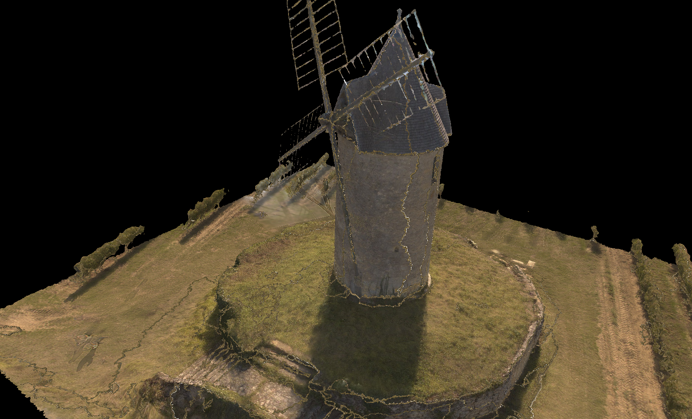

## Vulkan

I put this project here for my convenience, if you are looking for tutorials this is not the place.
Currently it is an ugly project with lots of mistakes and things not well made, it is the base for mu vulkan learning.

 For learning materials check:
- [vulkan-tutorial](https://vulkan-tutorial.com) - I started by reading this one
- [Intel tutorial](https://software.intel.com/en-us/articles/api-without-secrets-introduction-to-vulkan-part-1)
- [Vulkan Documentation](https://www.khronos.org/registry/vulkan/specs/1.0/html/vkspec.html) - very important (the website is a bit slow)
- [OGL Tutorials](https://learnopengl.com/#!Introduction) - good for glsl info
- [SaschaWillems github](https://github.com/SaschaWillems/Vulkan) - more complex/advanced code examples

When I started I was not aware of the amount of work need to render a single triangle, vulkan is very verbose.
Currently the program loads and renders (rotating) the model 'Moulin à vent de Saint-Aubin-de-Branne' (Gironde)(https://sketchfab.com/models/acad5c5dc20d46fdb86005f7d06ccf17) by dronena33(https://sketchfab.com/dronena33) is licensed under CC Attribution(http://creativecommons.org/licenses/by/4.0/), and maps the provided texture and has around 1000 lines of code.
At this moment the texture has some rendering errors (have yet to find the problem), the models looks right.



## Building

### Linux

To build on Linux just use the provided cmake project, but first you must install the dependencies:
- SDL2
- vulkan sdk //you need to check what your distro package is
- glm //for shader related maths
- cmake //so you can use the cmake files

After that, open terminal window at the base of the project (the folder with this file) and run the commands:

```
- mkdir build
- cd build
- cmake ..
- make -j
```
If no errors appear, the build is complete and you can run the program with the command ./vulkan
If you want to move the build, copy the folder 'data' and the file 'vulkan' from the build folder.

### Windows

The project is on a very early stage, it will suffer many changes and as I am developing it on a Linux box, I've not tried it on windows yet.
Although I have yet to try it, you can. You just need this code, the vulkan SDK, GLM library and base SDL2. Config your project, link the libs and you should be able to run it (you need the data folder on the same folder as the exe).

## Next
My current goal is to make a model viewer program where you can modify the scene (eg: add/mode lights, anti-aliasing,...). To get there, I have a lot to learn, and as I now have a basic program that can render models, I'll be reading more documentation and studying [Sascha Willems](https://github.com/SaschaWillems/Vulkan) more complex examples and apply them to my use case.
